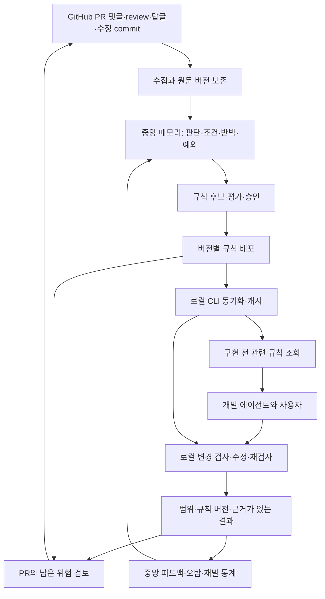

# Git Code Reviewer 사전 예방형 리뷰 플랫폼 기획안

작성일: 2026-09-10  
최종 수정일: 2026-09-11  
상태: 구현 전 최종 기획안  
대상: 중앙 Git Code Reviewer, GitHub/GHES 리뷰 이력, 로컬 리뷰용 VS Code·CLI·MCP·Agent Skill

이 문서는 AI 시대 코드리뷰에 관한 세 글의 적용 분석과 사용자의 `GitHub 리뷰 이력 → 중앙 code-reviewer → 개발 중 로컬 리뷰` 요구를 통합한다. 후속 요청에 따라 linter 기능 개발·연동·rule 배포는 범위에서 제외한다. 기존 기능과 신규 계획을 구분하며, 아래 API·명령·데이터 모델·운영 기본값은 구현 제안이다.

로컬 client는 [Commit Defender 재사용 검토](./commit-defender-integration-assessment.md)를 바탕으로 GitHub 2.3.0의 VS Code UI·계정 CLI adapter를 활용하고 공통 client core를 추가하는 방향으로 기획한다. 후속 요구에 따라 `standalone`과 `centralized` 모드, 사용자가 입력하는 중앙 서버 URL, cache 우선·standalone fallback, local memory·Skill 영속 저장을 지원한다. 실제 연결·저장 기능은 구현 전이다.

개발 순서·저장소별 commit·goal 완료 조건은 [사전 예방형 리뷰 플랫폼 구현 계획](./preventive-review-implementation-plan.md)에 정의한다.

## 1. 제품 목표와 결정

GitHub에서 사람이 확인한 리뷰 판단을 중앙에 축적하고, 개발자가 PR을 올리기 전에 로컬 변경을 리뷰할 때 활용한다. 변경 diff뿐 아니라 base branch의 구현, 현재 코드의 호출부·관련 module, 기존 리뷰와 반박·예외를 함께 읽어 회귀 위험과 설계상의 문제를 판단한다.

리뷰 대상은 Python에 한정하지 않는다. JavaScript·TypeScript·Java·Go·C#·Rust 등 다른 언어와 여러 언어가 섞인 repository도 같은 저장·리뷰·결과 조회 흐름을 사용한다. 특정 언어의 formatter·language server 설치를 리뷰의 필수 조건으로 두지 않는다. 언어별 분석 깊이와 검증된 지원 범위는 별도로 표시한다.

완료 기준은 comment 생성량이 아니라 같은 유형의 결함이 PR에 도달하는 빈도와 사람이 반복해서 설명하는 시간을 줄이는 것이다. 과거에 지적했다는 이유만으로 재발한 실제 결함을 숨기지 않는다. 오탐·허용 예외·이미 수정된 문제는 해당 조건을 현재 코드에서 확인한 경우에만 재지적을 줄인다.

제품 구조는 다음으로 결정한다.

- 중앙 서버는 리뷰 원천, 개인·집단 메모리, 리뷰 기준의 승인·버전·배포를 관리한다. 집단 메모리가 개인 메모리보다 우선한다.
- Web UI 로그인은 자체 배포한 Keycloak의 SAML로 처리한다. 사용자 관리 진입점·앱 역할·tenant/repo 권한·client token/API key는 GCR이 관리하고 비밀번호·MFA 원본은 Keycloak이 보관한다. PostgreSQL 자원은 공유하되 database·role·secret은 분리한다. [SAML·공유 DB 배포안](./keycloak-saml-deployment-design.md)을 따른다.
- 로컬 client는 작업 중인 repository와 정확한 base·HEAD·working tree·index를 읽고 리뷰에 필요한 코드를 수집한다.
- 기본 `standalone`은 중앙 서버·로그인 없이 built-in/local Skill·memory와 기존 모델 executor로 리뷰한다. `centralized`는 사용자가 입력한 서버의 정책·Skill·메모리를 sync하며, 연결 실패 시 유효 cache 또는 설정된 standalone fallback으로 계속 동작한다. 두 모드의 local 자료는 영속 저장하고 중앙 cache와 구분한다.
- VS Code 확장·local watcher·Git hook은 Save·Stage·Commit·Push 이벤트를 수집한다. 사용자가 설정에서 켠 시점만 공통 scheduler에 분석을 요청하며 중복·범위·예산·최신 결과를 관리한다. Typing은 변경 추적만 수행하고 작업 완료는 작성 주체와 무관한 공통 요청으로 처리한다.
- Review executor는 실제 코드와 선택 모드에서 사용할 수 있는 local/중앙 리뷰 지식의 적용 조건·반증을 확인해 맥락을 판단한다. 결과는 Summary·findings·근거·남은 질문으로 제시한다.
- CLI와 MCP는 같은 리뷰 기능을 제공하고 Skill은 작업 시작·수정·완료 때의 활용 절차를 전달한다.
- 기존 개발 에이전트는 사용자가 맡긴 개발 범위에서 문제를 수정하고 다시 리뷰한다. 중앙 PR 분석도 같은 리뷰 기준과 결과 형식을 사용한다.

Linter plugin·AST rule engine·기계적 rule pack의 생성과 배포는 이번 제품 범위에서 제외한다. 프로젝트가 이미 사용하는 formatter·linter는 그대로 별개로 운영한다. 테스트·타입 검사 결과는 필요할 때 리뷰의 근거로 참조할 수 있지만 그 도구의 성공을 문맥 리뷰 완료로 취급하지 않는다.

중앙에서 동기화하는 `Rule`은 이하에서 리뷰 기준을 뜻한다. 적용 조건, 설계 의도, 과거 판단, 반증 조건과 근거 참조를 가진 지식이며 실행 가능한 lint rule이 아니다.

LLM 호출량은 변경 묶음 처리, 관련 context만 조회, 유효한 이전 결과 재사용, 동시 실행·예산 제한으로 관리한다. 모델이 실행되지 않으면 맥락 리뷰를 완료했다고 표시하지 않는다. 코드 수집·이력 조회·승인된 기존 테스트 실행이 가능하더라도 리뷰는 대기·미완료 상태로 구분한다.

MCP는 호출 인터페이스이고 Skill은 사용 절차다. 설치만으로 저장 이벤트 수신이나 백그라운드 모델 실행이 보장되지 않는다. 자동 리뷰를 제공하려면 저장 trigger와 실제로 호출 가능한 review executor를 함께 연결해야 한다.

## 2. 앞선 글에서 채택할 방향

| 자료                                                                                                                                                                                                                       | 채택할 내용                                                        | 제품에 반영할 결정                                                                                                      |
| -------------------------------------------------------------------------------------------------------------------------------------------------------------------------------------------------------------------------- | ------------------------------------------------------------------ | ----------------------------------------------------------------------------------------------------------------------- |
| [Software Engineering is back](https://blog.alaindichiappari.dev/p/software-engineering-is-back) · [GeekNews 26502](https://news.hada.io/topic?id=26502)                                                                   | 에이전트에 반복 작업을 맡기고 사람이 설계·제약·예외 조건을 판단    | 기존 Git·검사 도구와 작은 공통 core를 재사용한다. framework 전면 교체는 추진하지 않는다.                                |
| [Every layer of review makes you 10x slower](https://apenwarr.ca/log/20260316-every-layer-of-review-makes-you-10x-slower) · [GeekNews 27608](https://news.hada.io/topic?id=27608)                                          | 리뷰 대기를 줄이고 반복 comment가 필요 없도록 테스트·규칙을 만든다 | 확인된 판단을 규칙 후보로 만들고 개발 단계에 배포한다. 승인 절차를 매 PR에 추가하기보다 재사용 규칙의 배포 시점에 둔다. |
| [The Agentic Awakening — Part I](https://theagenticawakening.com/build-the-churches.html), [Part III](https://theagenticawakening.com/assemble-the-community.html) · [GeekNews 33058](https://news.hada.io/topic?id=33058) | 자동 검증, 권한 통제, 위험에 따른 검토와 결과 측정                 | 로컬 검증 근거, 고위험 항목의 추가 확인, 규칙 품질과 재발률을 관리한다.                                                 |

10배 지연·생산성 배수는 해당 글의 경험칙이나 사례이며 이 제품의 효과 예측이나 목표치로 사용하지 않는다.

## 3. 현재 구현과 확장 범위

| 영역            | 확인된 구현                                                            | 이번 확장                                                                    |
| --------------- | ---------------------------------------------------------------------- | ---------------------------------------------------------------------------- |
| PR 대화         | 일반 댓글·review·inline comment, 작성자·SHA·위치·본문 버전 수집        | thread별 논의 결과, 반박·수정·예외의 근거 연결, 범위를 정한 과거 PR backfill |
| 메모리          | personal/collective, 후보·활성·폐기, 기여 집계·충돌 처리               | 확인된 판단의 규칙화, 적용 조건·예외·유효성 재검토                           |
| 우선순위        | 현재 근거 확인, 동일 주제의 집단 메모리 우선                           | 중앙 공용 규칙과 개인 보완 규칙을 분리해 로컬에도 배포                       |
| 코드 조회       | 정확한 base·merge-base·head, 격리된 workspace, Git·파일·관련 코드 탐색 | 로컬의 staged·working tree·branch 변경을 동일한 입력 모델로 검사             |
| Chat            | 근거 재조회, 사용자 질문, 재개·중단, 대화 이력                         | 개발 시작 전 규칙 조회와 검사·수정·재검사 절차 연결                          |
| 검토 결과       | Summary와 unit comment 구분, coverage·부분 완료·실패 표시              | finding 근거 수준, 의미 단위 중복 처리, 로컬·PR 발생 이력 연결               |
| 분석 운영       | 모델 예산·계정 admission·checkpoint·파일 병렬 처리                     | 로컬 변경 단위 캐시, 중앙 proxy 요청 예산·사용 범위 관리                     |
| 테스트          | 테스트 코드 정적 조회                                                  | 승인된 runner에서 실제 검사·테스트 실행                                      |
| 배포 인터페이스 | 브라우저·서버 API                                                      | 규칙 manifest·동기화 API, CLI, MCP 서버, Skill                               |
| 결과 측정       | 분석·모델·job 실행 기록                                                | 수정 반영·오탐·재발·규칙 동기화 지연·PR 대기 시간                            |

기존 finding fingerprint는 파일·side·line·본문에 의존하므로 다른 PR이나 line 이동을 포괄하는 영구 규칙 ID로 사용할 수 없다. 새 식별자를 추가하고 기존 fingerprint는 개별 발생 위치와 원문 추적에 유지한다.

기존 `verification.status=verified`는 파일·line의 존재 검증이다. 해당 값으로 실제 결함 재현이나 보안 취약점 확인을 추정하지 않는다. 기존 서버의 Git 도구는 읽기 전용이고 테스트 실행 도구가 없다. 본 기획의 실행 runner와 CI 연동은 현재 지원 범위를 확장하는 신규 기능이다.

## 4. 전체 구조



중앙은 PostgreSQL, 기존 Server/Worker와 artifact 저장소를 확장한다. 초기에는 별도 vector DB나 독립 agent framework를 도입하지 않는다. 운영 부하가 확인되면 규칙 평가 worker를 분리한다.

로컬 MCP 서버는 개발 도구 입장에서는 서버이고, 중앙 규칙 API 입장에서는 HTTP 클라이언트다. 원격 MCP 연결만으로 개발자 PC의 미커밋 파일을 읽을 수는 없으므로 로컬 구성요소를 둔다.

## 5. GitHub 이력을 메모리와 규칙으로 만드는 과정

### 5.1 수집 범위

현재 수집한 PR 대화에 thread·reply 연결, review의 제출·기각 상태, thread resolved/outdated, 관련 수정 commit과 merge 시점 정보를 추가한다. API에서 얻을 수 없는 값은 `unknown`으로 둔다.

초기 수집은 기존 polling에 증분 cursor와 실패 재시도를 추가한다. 이후 webhook으로 변경 신호를 받고 polling으로 누락을 보정한다. Webhook delivery ID와 원천 ID·content hash로 중복을 제거하고 순서가 뒤집힌 이벤트는 최신 원천 조회로 정합성을 맞춘다.

Open PR뿐 아니라 최근 종료된 PR의 마지막 논의·수정도 회수한다. 과거 Closed/Merged PR은 관리자에게 repository·기간·처리량을 지정받아 backfill한다. 현재 전체 상태 metadata 수집과 과거 대화 수집은 별개다. GitHub의 명시적 삭제·접근 불가·미수집을 구분하고, 삭제·비공개 전환된 원문에서 파생된 배포 자료도 재검토한다.

### 5.2 판단 단위 추출

댓글 하나를 곧바로 규칙으로 만들지 않는다. 같은 논의의 최초 지적, 반박, 합의와 수정 전후를 연결해 다음을 추출한다.

| 항목          | 내용                                                               |
| ------------- | ------------------------------------------------------------------ |
| 문제          | 실제로 어떤 입력·환경에서 무엇이 잘못되는가                        |
| 적용 범위     | repository, module, 언어, symbol, API contract, 유효한 branch·버전 |
| 검토 결론     | 확인된 결함, 확인된 오탐, 승인된 예외, 설계 결정, 미해결 질문      |
| 권고와 근거   | 필요한 변경과 그 이유, 원문·SHA·관련 source·검사 결과              |
| 반증 조건     | 어떤 전역 설정·호출 경로·보완 제어가 있으면 지적이 성립하지 않는가 |
| 책임과 유효성 | 검토자, 검토 시각, 재검토 조건·만료·대체 관계                      |

PR 승인·merge·thread resolve는 참고 신호다. 실제 코드에서 문제가 사라졌거나 지적이 틀렸다는 결론과 동일하게 처리하지 않는다. 작성자·reviewer를 별도 권한 확인 없이 중앙 관리자와 동일 인물로 간주하지 않는다.

AI가 추출한 판단은 후보 상태다. 현재 personal→collective 집계 경로를 유지하되, repository별 위임을 받은 rule maintainer가 공용 PR의 확인된 판단을 직접 공용 후보로 선별하는 경로를 추가한다. 이 경로는 두 사람의 개인 메모리 기여를 꾸며 내지 않고 `maintainer-curated` 출처와 승인 기록을 남긴다. 기존 전역 관리자 권한에 더해 repository 단위 권한을 새로 구현한다.

### 5.3 반복을 처리하는 기준

| 과거 판단                      | 다음 로컬 검사                                                | 다음 PR 리뷰                                           |
| ------------------------------ | ------------------------------------------------------------- | ------------------------------------------------------ |
| 실제 결함이며 수정됨           | 수정 전/후 사례를 학습 자료와 검사 fixture로 삼아 재발을 찾음 | 같은 위반이 다시 생기면 재발로 보고                    |
| 실제 결함이며 아직 남아 있음   | 기존 발생 이력과 함께 표시                                    | 동일 revision에서는 새 댓글을 쌓지 않고 기존 항목 갱신 |
| 현재 조건에서 오탐임           | 반증 조건을 확인해 지적 생략                                  | 생략 근거와 규칙 revision 기록                         |
| 의도된 API 변경 등 승인된 결정 | 해당 branch·대상 소비자·migration 조건 안에서 적용            | 범위를 벗어나면 다시 검토                              |
| 기간 한정 위험 수용            | 예외 범위와 만료를 적용                                       | 만료·전제 변경 시 재등장                               |
| 논의가 끝나지 않음             | advisory 또는 확인 질문                                       | 합의된 규칙으로 취급하지 않음                          |

“메모리에 있으므로 생략” 같은 포괄적 suppression은 만들지 않는다. 같은 topic의 여러 댓글은 하나의 판단과 연결하되, 다른 발생 조건이나 endpoint의 결함은 독립 항목으로 유지한다.

## 6. 중앙 리뷰 기준과 운영

### 6.1 메모리·리뷰 기준·발생 이력

- `Memory`: 무엇을 왜 판단했는지 보존하는 지식. 현재 개인·집단 구조를 재사용한다.
- `Rule`: 어떤 상황에서 무엇을 검토해야 하는지 명시한 버전별 리뷰 기준. Linter 조건식이나 실행 코드가 아니다.
- `Occurrence`: 특정 revision의 리뷰에서 발견한 문제와 후속 수정·반박 이력.
- `Exception`: 승인된 범위·기간·사유가 있는 정책 예외.

| 필드                                               | 역할                                                       |
| -------------------------------------------------- | ---------------------------------------------------------- |
| `ruleId`, `revision`, `contentHash`                | 영구 식별자, 불변 버전, 무결성                             |
| `tenantId`, `repositoryId`, `scope`, `ownerUserId` | 공용·개인 배포 범위와 권한                                 |
| `topicKey`, `sourceRefs`                           | 의미 단위 연결과 원문·메모리·수정 commit의 provenance      |
| `appliesTo`                                        | 관련 업무·언어·경로·symbol·contract·branch 또는 버전       |
| `requirement`, `rationale`, `counterEvidence`      | 검토 기준, 이유, 반증 조건                                 |
| `reviewSteps`, `contextRefs`, `validationRefs`     | 조사할 경로·설정·호출부, 관련 source·문서·기존 테스트 참조 |
| `examples`, `evaluationSet`                        | 실제 결함·수정·정상·오탐 사례와 평가 기준                  |
| `severity`, `enforcement`                          | P0–P3 영향도와 별도 검토 정책                              |
| `state`, `reviewedBy`, `reviewedAt`                | 승인·배포 상태                                             |
| `reviewAfter`, `supersedes`, `dependencies`        | 재검토, 대체, 필요한 source·도구·기준 version              |

자연어 기준을 받았다고 모든 동작을 검증할 수 있다고 가정하지 않는다. 필요한 코드·업무 조건을 확인하지 못하면 `needs-context` 또는 `incomplete`로 남긴다. `topicKey`는 후보 묶음에 쓰고, 다른 판단을 AI 유사도만으로 자동 합치지 않는다.

### 6.2 리뷰 관점

| 관점                | 로컬 리뷰에서 확인할 내용                                                      |
| ------------------- | ------------------------------------------------------------------------------ |
| 과거 결함의 재발    | 이전 원인과 수정 방식을 읽고 현재 입력·호출 경로에도 같은 조건이 생겼는지 확인 |
| API 계약·호환성     | Base와 변경본의 계약, 실제 소비자와 migration 계획을 함께 검토                 |
| 업무 로직·상태 전이 | Cache·DB·집계·동시성 등의 입력 조건과 실패 경로를 추적                         |
| 권한·데이터 영향    | Endpoint뿐 아니라 전역 설정·middleware·호출부와 보완 통제를 확인               |
| 설계 결정·예외      | 과거 합의가 현재 branch·소비자·기간에 유효한지 확인                            |
| 미해결 질문         | 합의된 정책으로 처리하지 않고 사용자에게 필요한 판단을 질문                    |

리뷰 기준·댓글·repository 문서는 모두 분석 자료다. 그 안의 지시로 shell·설치·network·tool 권한을 추가하지 않는다. Bundle에는 실행 script와 임의 tool 정의를 넣지 않고 client 실행 코드의 업데이트와 지식 sync를 분리한다.

### 6.3 승인과 배포

```text
draft → evaluated → shadow → active → deprecated / revoked
```

후보 기준은 실제 결함·수정·정상·반증 사례로 평가한다. 모델의 문장 일치보다 관련 근거를 확인했는지, 조건이 다른 정상 사례를 결함으로 오인하지 않는지 판단한다. `shadow`에서는 개발을 막지 않고 실제 반복 지적과 오탐을 관찰한다.

Repository별 위임을 받은 maintainer가 공용 기준을 승인한다. 고위험 기준과 예외는 지정 security/domain owner의 검토를 거친다. 개인 기준은 집단 기준을 보완하며 약화하지 않는다. 현재 코드가 과거 메모리의 오류를 드러내면 그 판단을 재검토하되 권한 정책 자체를 임의 해제하지 않는다.

초기 리뷰는 advisory로 제공한다. 자연어 기준과 모델의 위반 판단만으로 저장·commit·merge를 자동 차단하지 않는다. 향후 별도 검토 정책을 도입하더라도 근거 수준·담당자 확인·실패 상태를 구분하며 모델의 확신을 기계적 gate로 전환하지 않는다.

### 6.4 화면 구성

중앙의 `Review criteria` 메뉴에서 기준·적용 범위·공개 상태·최근 오탐을 관리한다. 상세에는 원문 논의→메모리 판단→수정 사례→평가→배포 revision을 연결한다.

`Review history`는 확인된 논의와 미해결 후보를, `Client sync`는 권한이 있는 client의 최신성·호환성을, `Outcomes`는 재발과 검토 시간을 보여준다. 일반 사용자는 기준과 이유를 읽고 오탐·예외를 제출하며 설정은 해당 권한 보유자가 변경한다.

## 7. Server–client 동기화

구체적인 모드·서버 주소 입력·fallback·저장·protocol은 [정책·메모리 sync 설계](./client-review-knowledge-sync-design.md)를 따른다. 이 절의 중앙 인증·sync는 `centralized`에 적용하며 `standalone`에서는 실행하지 않는다. 정책·Skill·집단 메모리·본인 개인 메모리를 배포하고 사용자별 manifest가 지정한 조합을 원자적으로 활성화한다.

### 7.1 저장소와 사용자 식별

초기 설정에서 `standalone`/`centralized`를 선택한다. Standalone은 local profile·repository 식별만 수행하고 중앙 ID를 요구하지 않는다. Centralized에서는 `commitDefender.centralized.serverUrl`에 Git Code Reviewer base URL을 입력하고 연결 테스트·로그인 후 repository를 연결한다. 주소 입력만으로 중앙 모드를 자동 활성화하거나 다른 서버에 기존 token을 전송하지 않는다.

Centralized의 `gcr init`은 현재 Git root와 remote의 인증정보를 제거한 origin을 확인하고 중앙의 repository ID에 연결한다. 같은 이름의 repository라도 GitHub instance와 tenant가 다르면 별개다. URL에 포함된 PAT는 전송·로그에 남기지 않는다. 여러 remote/fork 중 선택이 모호하면 최초 연결에서 명확히 지정한다.

Centralized client는 GCR 사용자 계정에 귀속된 기기별 credential로 접속한다. GCR UI는 Keycloak SAML로 로그인하며 그 웹 session에서 client 연결을 승인한다. GCR 내부 PKCE·headless device flow·access/refresh token 발급·회전·폐기와 scope·만료 제한 개인 API key 계획은 유지한다. SAML assertion을 API bearer로 재사용하지 않는다. 지원 client는 Commit Defender/CLI로 제한하고 범용 SSO·OIDC provider 제품은 GCR 구현 범위에 넣지 않는다. Secret은 OS credential store에 저장하고 공용 고정 key나 브라우저 cookie를 복사하지 않는다. 발급·폐기·SAML session과의 연결은 [client 인증 설계](./client-authentication-design.md), 실제 배포 구조는 [Keycloak SAML·공유 PostgreSQL 배포안](./keycloak-saml-deployment-design.md)을 따른다.

권한은 `rules:read`, `memories:read`, `sources:read`, `reviews:submit`, `feedback:submit`, 선택적 `ai:invoke`, 유지관리용 `rules:manage`로 나눈다. 최초 sync에는 앞의 두 읽기 scope만 부여하고 추가 기능은 별도 승인한다. 모든 요청에서 tenant membership와 repository grant를 확인한다. GitHub PAT와 중앙 모델 계정의 credential은 client로 배포하지 않는다.

### 7.2 동기화 시점과 기본값

다음은 MVP의 제안값이며 설정과 부하 검증 후 조정한다.

- 저장소 연결·client 시작 시 동기화한다.
- 검사 시작 전에 manifest freshness를 확인한다. 마지막 확인이 5분 이내면 일반 로컬 검사에서 캐시를 재사용한다.
- 활성화한 `gcr watch`는 5분 간격에 jitter를 더해 manifest를 확인한다. 파일 변경은 debounce해 영향 범위만 재검사한다.
- 절전 복귀, 네트워크 재연결, remote/branch 전환 시 다음 검사 전에 scope와 freshness를 재확인한다.
- 사용자는 `gcr sync`로 즉시 갱신한다. 백그라운드 설치·상시 실행은 client onboarding에서 선택한다.
- 배포 단계에는 SSE 등 변경 알림을 추가할 수 있다. 알림은 갱신 신호이며 실제 내용은 인증된 API에서 가져온다.

CLI는 watch가 꺼져 있어도 검사 전 갱신한다. 외부 IDE가 Skill을 호출하지 않거나 agent가 조기 종료해도 명시적 CLI 검사는 독립적으로 동작해야 한다.

규칙 갱신 주기와 코드 검증 시점은 별개다. 5분 간격은 manifest 확인 주기이며 저장한 코드의 검사를 5분 뒤로 미루는 뜻이 아니다. 저장 후 변경 수집과 리뷰 준비는 유효한 local bundle로 수행하고 필요 시 갱신을 병행한다. 새 기준·메모리가 활성화되면 영향받는 결과를 stale로 표시하며, 선택된 자동 분석 시점·예산 또는 수동 요청에 따라 다시 검사한다. Sync 자체는 LLM을 호출하지 않으며 cache 만료·인가 실패는 해당 검사 상태에 표시한다.

### 7.3 Manifest와 atomic update

Manifest는 `schemaVersion`, 사용자·tenant·repository scope, `snapshotId`, 정책·집단·개인 component별 `releaseSequence`·`bundleId`·`contentHash`, client 호환 범위, 발급·만료 시각과 revocation 정보를 포함한다. 각 bundle은 항목별 revision/hash를 보존한다. 서버 서명과 조직이 배포한 신뢰 키로 출처를 확인한다. Hash만으로 배포자의 신원을 보증하지 않는다.

ETag 조건부 요청으로 변경이 없으면 304를 반환한다. 변경이 있으면 임시 공간에 bundle을 다운로드하고 크기·schema·서명·hash·scope·client 호환성을 검증한 뒤 atomic rename으로 활성화한다. 한 검사는 시작한 bundle과 context에 고정하며 실행 중 새 버전을 섞지 않는다.

첫 구현은 완전한 작은 bundle을 배포한다. 이후 delta 전송을 추가할 때는 pinned release의 모든 page, 삭제 tombstone, cursor reset/full-resync를 지원한다. 기존 cache와 동시에 쓰는 CLI/MCP/watch는 lock과 단일 활성 포인터를 공유한다.

잘못된 규칙을 되돌릴 때는 과거 내용을 새 `releaseSequence`로 발행해 rollback 의도를 명시한다. Cache를 조작해 더 오래된 manifest를 최신으로 받아들이는 동작과 구분한다. 폐기된 rule은 다음 sync에서 비활성화한다. 실행 중 critical revocation을 수신하면 결과를 stale로 표시하고 중앙에서 유효한 검증으로 수용하지 않는다.

### 7.4 오프라인과 장애

네트워크 오류와 401/403을 구분한다. 일반 통신 장애에는 만료 전 마지막 정상 bundle로 로컬 검사를 계속하며 사용 버전·age·동기화 실패를 표시한다. 권한 철회 응답이면 해당 계정·repository cache의 사용을 중단하고 관리 대상 자료를 정리한다.

초기 중앙 cache의 offline 유효 기간은 최대 24시간을 제안하되 민감한 repository는 짧게 설정한다. 기본 `cache-then-standalone`은 연결 실패 시 유효 cache를 사용하고, 없거나 만료됐으면 built-in/local Skill·memory만으로 standalone 리뷰를 수행한다. 대안으로 `cache-only`, `standalone`, `pause`를 선택할 수 있다. 중앙 인가 실패·폐기된 자료는 cache로 사용하지 않는다.

Fallback 결과에는 실제 모드와 이유를 기록하고 중앙 기준 충족 결과로 재사용하지 않는다. 만료된 기준에 대한 중앙 검증은 `incomplete: rules-stale`로 구분한다. 허용된 모델 executor가 없으면 AI 리뷰는 미완료이며 지식 관리·과거 결과 열람만 유지한다. 사용자 선택 모드·서버 주소는 fallback 때 바꾸지 않고, 중앙 복구 후 다음 리뷰부터 유효한 중앙 snapshot을 적용한다.

오프라인 client의 권한 철회는 즉시 보장할 수 없다. Cache 만료·재인증으로 노출 기간을 제한하며 이미 읽거나 복사한 데이터를 원격으로 회수한다고 약속하지 않는다. 중앙 검사·향후 CI gate는 최신 인가와 정책으로 재검증한다.

### 7.5 API 제안

| API                                                               | 목적                                                           |
| ----------------------------------------------------------------- | -------------------------------------------------------------- |
| `GET /api/v1/client-auth/config`                                  | GCR 자체 인증 방식·endpoint·public client ID·API audience 안내 |
| `GET /api/v1/client-auth/authorize`                               | GCR 계정 로그인·PKCE client 승인 시작                          |
| `POST /api/v1/client-auth/device`                                 | GCR의 headless 기기 연결 승인 요청                             |
| `POST /api/v1/client-auth/token`                                  | GCR의 code 교환·token 발급·회전·갱신                           |
| `POST /api/v1/client-repositories/resolve`                        | origin과 명시한 repository를 중앙 ID에 연결                    |
| `GET /api/v1/repositories/:id/review-knowledge/manifest`          | 정책·집단·본인 개인 bundle 조합, ETag·폐기·호환성              |
| `GET /api/v1/repositories/:id/review-knowledge/bundles/:bundleId` | Scope와 현재 권한 확인 후 불변 bundle 다운로드                 |
| `GET /api/v1/repositories/:id/review-knowledge/sources/:sourceId` | 권한이 있는 원문·근거를 명시적으로 조회                        |
| `GET /api/v1/rules/:ruleId/revisions/:revision`                   | 규칙 설명과 열람 가능한 원문 provenance                        |
| `POST /api/v1/local-review-runs`                                  | idempotency key가 있는 결과 metadata 제출                      |
| `POST /api/v1/repositories/:id/review-knowledge/feedback`         | 오탐·수정·예외·메모리 후보 제출, 자동 정책 변경 없음           |
| `POST /api/v1/ai-checks`                                          | 선택적 중앙 AI 분석; source 전송 정책과 별도 예산 적용         |

관리 API는 후보 생성·평가·배포·폐기·예외 승인으로 분리한다. 다운로드 endpoint의 UUID를 아는 것만으로 다른 tenant의 bundle을 읽을 수 없어야 한다. 개인 overlay는 공용 artifact URL이나 공용 PR 출력에 포함하지 않는다.

## 8. 로컬 리뷰·VS Code·CLI·MCP·Skill

### 8.1 구성과 실행 책임

첫 client는 Node.js 기반 공통 core·scheduler·CLI, VS Code 확장과 stdio MCP 서버로 제공한다. 초기 검증 플랫폼은 macOS와 Linux다. Windows와 Remote SSH·Dev Container 조합은 경로·실행 환경·credential store·권한 검증 후 지원한다.

Node.js는 client의 구현 환경이며 리뷰 대상 언어의 제한이 아니다. VS Code 확장과 watcher도 특정 언어 확장에 의존하지 않고 설정된 repository의 source 변경을 수집한다.

공통 core는 mode resolver, local knowledge store, 중앙 snapshot store, sync service를 분리한다. 사용자 memory와 Skill의 생성·편집·활성화·삭제·가져오기/내보내기는 standalone에서도 가능하며 재시작 후 유지한다. 중앙 Skill의 실제 내용도 cache에 저장하되 readonly로 관리하고 local 편집본을 덮어쓰지 않는다. 사용자가 확인한 fallback에서도 동일한 trigger 설정·예산을 적용하고 다른 모델 제공자로의 전송은 별도 승인된 경로만 사용한다.

| 구성                   | 책임                                                                             |
| ---------------------- | -------------------------------------------------------------------------------- |
| `gcr` CLI              | 인증·repository 연결·sync·리뷰 요청·결과 조회                                    |
| 공통 local core        | Source snapshot, 중앙 메모리·기준 선택, context 조회, executor 연결, 결과 schema |
| 공통 scheduler         | 변경 묶음 처리, 리뷰 범위·예산, 중복·취소·최신 결과 관리                         |
| VS Code 확장           | 저장·외부 파일 변경 수신, 리뷰 요청, Problems·Summary·상태 표시                  |
| Review executor        | 현재 코드·기존 구현·리뷰 이력을 종합하는 실제 모델 실행                          |
| `gcr mcp`              | 개발 에이전트에 context·리뷰·결과·피드백 도구 제공                               |
| `gcr-prevention` Skill | 구현 전 맥락 조회, 수정 후 리뷰·질문·재검토 절차                                 |
| `gcr watch`            | IDE 밖에서 파일 변경을 받고 같은 scheduler로 리뷰 요청                           |

MCP transport와 지원 protocol version은 host 호환성 행렬로 고정한다. MCP 자체는 모델 계정 공유·자동 추론·저장 trigger를 보장하지 않는다. [MCP architecture](https://modelcontextprotocol.io/docs/learn/architecture)

Skill은 중앙 지식 전체를 복사하지 않고 작업 대상의 메모리·기준·revision을 도구로 읽도록 안내한다. Skill 준수 여부를 리뷰 실행 결과로 취급하지 않는다. [Agent Skills 개요](https://agentskills.io/home)

### 8.2 CLI 계약 예시

다음은 제안 명령이며 아직 구현된 제품 명령이 아니다.

```sh
gcr login
gcr init
gcr sync
gcr status
gcr context --paths src/api src/services
gcr review --working-tree
gcr review --staged
gcr review --base origin/develop
gcr review --working-tree --format json
gcr explain RULE-ID
gcr watch
gcr mcp
```

`context`는 요구사항·변경 경로에 맞는 메모리·리뷰 기준·기존 코드·테스트 위치를 반환한다. `review`는 snapshot과 사용 기준을 고정하고 실행 가능한 executor에 실제 맥락 리뷰를 요청한다. 빠른 정적 검사 명령으로 대체하지 않는다.

명령의 결과는 완료·발견된 문제·추가 질문·미완료·실패를 구분한다. 종료 코드는 `0=선택한 범위의 리뷰 완료·정책상 후속 조치 항목 없음`, `1=확인이 필요한 finding·질문 있음`, `2=실행 미완료·환경/인가/모델 오류`를 기본 제안으로 둔다. Exit 0은 전체 시스템의 안전성이나 merge 승인을 뜻하지 않는다.

자동 리뷰는 공통 실행 조건을 통과한 뒤 비동기로 요청하고 실행 ID와 상태를 제공한다. UI·CLI·MCP·연동 도구의 완료 신호는 같은 작업 완료 계약에 연결한다. 사용자가 원할 때만 commit·push hook과 연결한다. 기존 hook·formatter·linter 설정을 변경하거나 hook을 덮어쓰지 않는다. Hook에서 기다릴지 알림만 남길지도 별도 설정이며 초기에는 advisory다.

### 8.3 MCP와 coding agent

| 도구                    | 동작                                                      |
| ----------------------- | --------------------------------------------------------- |
| `gcr_status`            | Repository·bundle age·review executor·자동 실행·예산 상태 |
| `gcr_sync_rules`        | 인가된 리뷰 기준·메모리를 검증해 cache에 반영             |
| `gcr_get_context`       | 요구사항·경로·변경에 맞는 과거 판단과 근거 조회           |
| `gcr_prepare_review`    | 정확한 snapshot·diff·관련 source를 준비; 리뷰 완료는 아님 |
| `gcr_review_changes`    | 구성된 executor에 맥락 리뷰 요청; 실행 ID 반환            |
| `gcr_get_review_result` | 진행·완료·미완료·실패·취소와 결과 조회                    |
| `gcr_submit_review`     | Host agent가 수행한 리뷰와 source·기준·근거 metadata 제출 |
| `gcr_get_rule`          | 리뷰 기준의 조건·반례·이유 조회                           |
| `gcr_submit_feedback`   | 확인된 수정·오탐·예외 요청 제출                           |

Host agent가 자신의 모델로 리뷰할 때는 context 준비·파일 조회 도구를 사용하고 결과를 제출한다. 별도 executor가 필요한 자동 실행과 구분한다. Host 제출 결과는 client self-report이며 trusted CI 검증으로 승격하지 않는다.

Root는 연결한 실제 Git root에 고정한다. 임의 tool 인수·source 내용·중앙 기준으로 접근 범위를 늘리지 않는다. Repository 파일과 Git 조회는 승인된 읽기 도구를 재사용하며 테스트·수정 등 추가 권한은 별도 통제한다.

### 8.4 Skill의 실행 절차

1. 작업 시작 시 repository·sync 상태와 요구사항에 관련된 과거 판단을 확인한다.
2. 기존 구현·관련 호출부·반증·예외를 읽고 수정 방향에 반영한다.
3. 변경 후 실제 source snapshot으로 로컬 리뷰를 수행한다.
4. 확인할 수 없는 업무 의도·설계 선택은 사용자에게 질문하고 가정과 사실을 구분한다.
5. 사용자가 맡긴 범위에서 수정한 뒤 영향받는 항목을 재리뷰한다.
6. Summary·findings·source 근거·참조한 과거 판단·남은 검증 범위를 보고한다.

자동 리뷰는 source를 읽고 의견을 제시하는 것이 기본이다. 저장 이벤트만으로 수정·commit·push·GitHub 댓글 게시를 실행하지 않는다. 수정 루프에도 시간·호출·반복 한도를 둔다.

### 8.5 자동 분석 시점 설정

사용자는 로컬 설정의 `Review → 자동 분석 시점`에서 Save·Stage·Commit·Push를 각각 선택한다. 단일 선택이 아니라 네 개의 독립된 toggle이며 여러 시점을 함께 켜거나 모두 끌 수 있다. 이전의 저장 시 모델 호출을 일괄 금지하는 제안은 이 설정으로 대체한다. Typing은 분석 trigger에 포함하지 않는다.

#### 선택 항목과 분석 대상

| 설정 항목      | 이벤트 정의                                                     | 분석할 snapshot                                                              |
| -------------- | --------------------------------------------------------------- | ---------------------------------------------------------------------------- |
| Save 시 분석   | 파일 저장이 끝난 뒤 변경을 묶어 요청                            | 저장된 working tree의 변경과 관련 코드; 미저장 buffer는 제외                 |
| Stage 시 분석  | Git index의 실제 내용이 바뀌고 연속 stage 작업이 안정된 뒤 요청 | HEAD 또는 설정된 기준 대비 index snapshot; 부분 staging을 정확히 반영        |
| Commit 시 분석 | Commit 실행 전 hook에서 요청                                    | 해당 commit이 실제 사용할 index·비교 기준; 단순 working tree로 대체하지 않음 |
| Push 시 분석   | Push 실행 전 hook에서 요청                                      | 전송할 ref·commit의 확정된 변경 범위; 다른 미커밋 변경은 제외                |

UI에서는 시점이 모호하지 않도록 Commit과 Push를 각각 ‘Commit 전’, ‘Push 전’으로 표시한다. 이 설정은 리뷰 요청 시점을 정하며 실행 결과까지 기다릴지와 작업을 차단할지는 별도 정책이다. Stage는 index 변경 감지, Commit·Push는 Git hook 연동으로 연결한다. [Git staged diff](https://git-scm.com/docs/git-diff), [Git hooks](https://git-scm.com/docs/githooks)

Stage 선택 시 파일의 mtime만 확인하지 않고 index 내용을 비교한다. Unstage·index 복구는 현재 결과의 유효성을 갱신하고 남은 변경이 없으면 모델을 호출하지 않는다. Commit의 임시 index·부분 commit·amend와 Push의 여러 ref·새 branch 등은 실제 Git 입력을 기준으로 해석한다. 지원되지 않거나 기준이 불명확하면 미완료로 표시하고 엉뚱한 source로 분석하지 않는다.

#### 설정 범위와 기본값

설정은 사용자 기본값과 개인별 repository override를 지원한다. 한 repository에서 선택한 실행 시점을 다른 개발자에게 강제로 적용하지 않는다. 중앙 집단 메모리의 우선권은 리뷰 판단 기준에 적용하며 개인의 실행 시점 선택과는 별개다. 상위 source 전송·권한·예산 정책은 유지한다.

새 client에서 비용이 발생하는 자동 분석은 최초에 모두 꺼 두고 사용자가 선택하게 한다. 설정 화면에서 Stage만 선택하는 시작 구성을 제안할 수 있으나 자동 적용하지 않는다. 이는 초기 설계값이며 기존 사용자의 선택은 업데이트 때 보존한다. Repository의 공유 설정 파일이나 중앙 지식 bundle만으로 개인 client의 자동 실행·hook을 켜지 않는다.

다음은 구현 전 설정 계약 예시이며 현재 유효한 VS Code 설정 키가 아니다.

```json
{
  "gcr.review.triggers.save": false,
  "gcr.review.triggers.stage": false,
  "gcr.review.triggers.commit": false,
  "gcr.review.triggers.push": false
}
```

설정 화면은 선택 여부와 함께 실제 동작 상태를 보여준다. 예를 들어 ‘Push 전: 켜짐 / hook 연결 필요’, ‘Save: 켜짐 / executor 미설정’, ‘Stage: 켜짐 / 예산 대기’를 구분한다. 체크박스만 켜졌다고 분석이 가능하다고 표시하지 않는다. Hook 연결은 사용자의 선택과 실행 환경 확인을 거쳐 제공하고 기존 hook manager·설정을 덮어쓰지 않는다.

#### Save·Stage의 호출량 조절

Save가 꺼져 있으면 저장 시 변경 추적·hash 갱신만 수행하고 모델을 호출하지 않는다. 켜져 있으면 연속 저장을 묶어 마지막 snapshot의 리뷰를 예약한다. 초기 제안은 저장 후 3초 debounce와 Save 자동 리뷰 간 최소 10분 간격이며 두 값을 사용자에게 표시하고 조정 가능하게 한다. 이는 측정된 최적값이 아니다.

‘Auto Save 포함’과 ‘외부 프로그램의 파일 변경 포함’은 Save의 하위 옵션으로 분리하고 처음에는 끈다. 포함하지 않은 이벤트도 결과의 stale 여부는 갱신하지만 새 모델 호출을 만들지 않는다. 외부 변경을 포함한 경우 작성자가 사람인지 AI인지에 따라 분석 정책을 달리하지 않는다. Typing 이벤트가 Auto Save로 이어져도 편집 중에는 대기 변경을 병합하고 저장된 최신 입력만 대상으로 삼는다.

Stage도 연속 index 변경을 묶는 대기 시간과 필요 시 최소 실행 간격을 설정한다. 초기 debounce는 3초를 제안한다. Save·Stage의 간격 제한으로 미룬 요청은 사라지지 않고 실행 예정 조건을 표시하며, 실행 직전에 선택 설정·현재 snapshot·미저장 상태·예산을 다시 확인한다. Commit·Push 요청은 Save의 대기 간격에 묶지 않되 공통 예산은 준수한다.

시점을 끄면 해당 시점에서 유래한 대기 요청만 제거한다. 이미 보낸 모델 요청은 가능한 경우 취소하되 발생한 비용을 되돌릴 수 있다고 약속하지 않는다. 다른 켜진 시점과 합쳐진 요청 또는 명시적 ‘지금 리뷰’는 독립적인 요청 사유를 보존한다.

#### Commit·Push의 대기 정책

기본은 advisory다. Hook은 리뷰를 예약하고 현재 결과·대기 상태를 알리며 명령을 계속 진행하도록 설계한다. 이 경우 ‘Commit/Push 전에 리뷰 완료’ 또는 ‘검증을 통과한 변경만 전송’이라고 표시하지 않는다. 실행 프로세스는 hook 종료와 함께 사라지지 않도록 공통 local service에 위임한다. Service가 없으면 연결 실패를 표시한다.

사용자가 원하는 경우 ‘리뷰 완료까지 대기’를 선택할 수 있다. 대기 timeout·실패·모델 한도 초과를 성공으로 바꾸지 않고 명확히 알린다. 초기에는 기다리는 기능과 finding에 따른 자동 차단을 분리하며, 별도 승인 없는 모델 판단으로 commit·push를 막는 정책은 추가하지 않는다. 일반 CLI의 finding 종료 코드를 hook의 차단 코드로 그대로 전달하지 않도록 adapter 계약을 둔다.

Hook이 꺼져 있거나 지원되지 않는 Git 실행 경로는 미관측으로 표시한다. Local hook은 우회 가능하므로 중앙 정책 집행이나 trusted CI의 대체물이 아니다. 자동 리뷰가 Git 명령·index·원격 상태를 수정하지 않는다.

#### 공통 요청과 중복 제거

분석 요청은 `trigger=save|stage|commit|push`와 repository·검토 범위·source snapshot·설정 revision을 가진다. 같은 검토 입력에 여러 시점이 겹치면 실행 한 건에 요청 사유들을 연결한다.

Trigger 이름 자체는 결과 재사용의 차이를 만드는 기준이 아니다. 실제 base·input tree·조회 context·중앙 기준·review profile·tool·model 설정이 같고 결과가 유효한 범위만 재사용한다. 파일 내용이 비슷하거나 같은 작업 ID라는 이유만으로 Save 결과를 Stage·Commit·Push의 결과로 대신하지 않는다. 기존 범위 밖의 변경이나 새로운 근거가 필요하면 해당 범위를 추가 리뷰한다.

작성자가 사람인지 AI인지에 따른 완료 구분은 하지 않는다. UI·CLI·MCP·연동 도구의 명시적 완료 요청은 기존 공통 `work_completed` 계약과 같은 pipeline을 사용한다. ‘지금 리뷰’는 네 toggle과 관계없이 직접 실행할 수 있다.

최초 설정에서 유휴 자동 리뷰와 자동 완료 hook 연동은 끈다. 이 부가 기능을 나중에 켜는 경우 별도 고급 설정에 드러내고 네 시점을 모두 꺼도 자동 호출할 수 있다는 점을 표시한다. ‘자동 분석 모두 끄기’는 네 시점과 부가 자동 trigger를 함께 중지한다. 명시적인 사용자 리뷰 요청은 유지한다.

규칙 sync·source 추적·hash 계산에는 모델을 사용하지 않는다. 실제 실행 조건을 통과한 뒤 필요한 source·중앙 메모리를 조회한다. 한 리뷰가 여러 모델 호출을 사용할 수 있으므로 실행별 호출 수·입출력 token·시간과 사용자·repository별 누적 예산을 함께 적용한다. 실패 재시도도 같은 예산과 backoff에 포함한다. 미실행·대기·부분 완료를 분석 성공으로 표시하지 않는다.

### 8.6 VS Code 연결과 최신 결과 관리

```text
편집·저장·외부 변경 → 로컬 변경 추적·미리뷰 상태
  → Save·Stage·Commit·Push 중 선택된 시점과 예산 확인
  → 명시적 리뷰 요청도 같은 scheduler에서 처리
  → 변경 묶음과 snapshot → 관련 코드·중앙 리뷰 이력 조회
  → 맥락 리뷰 → Summary·findings·질문
  → 수정 후 영향 범위 재리뷰
```

VS Code 확장은 `workspace.onDidSaveTextDocument`로 저장 완료를 받고 `workspace.createFileSystemWatcher`로 외부 프로그램·agent의 파일 변경을 보완한다. `onWillSaveTextDocument`에서 긴 리뷰를 기다리지 않는다. Formatter 처리 후 저장된 내용을 읽고 같은 내용의 이벤트는 content hash로 합친다. [VS Code 저장·파일 이벤트](https://code.visualstudio.com/api/references/vscode-api#workspace)

`workspace.onDidChangeTextDocument`는 실제 내용 변경을 구분해 마지막 편집 시각과 미저장 상태를 추적하는 데만 사용한다. 해당 이벤트만으로 모델을 호출하지 않는다. 선택한 Save 지연 정책과 부가 유휴 기능은 workspace의 코드 편집·파일 변경을 기준으로 하며 전역 키보드 입력을 수집하지 않는다. [VS Code 문서 변경 이벤트](https://code.visualstudio.com/api/references/vscode-api#workspace.onDidChangeTextDocument)

MVP는 저장된 snapshot을 리뷰한다. 다시 편집한 미저장 buffer를 완료 상태로 표시하지 않으며 후속 편집 중 분석은 document version을 별도 추적한다. 실제 input hash와 표시 중인 source가 달라지면 결과를 stale로 표시한다.

파일 위치가 있는 finding은 밑줄·Problems에 표시하고, 전체 Summary·복합 이슈·과거 논의·근거·추가 질문은 별도 GCR 리뷰 화면에 둔다. 이는 linter 기능이 아니라 같은 IDE 진단 표시 방식을 사용하는 리뷰 UI다. 대기·context 준비·리뷰 중·완료·미완료·실패·취소·오래된 결과와 마지막 시각·범위·기준 version을 표시한다. 매 저장마다 popup을 띄우지 않고 일시 중지·재개·수동 리뷰를 제공한다.

- VS Code·watch·MCP는 공통 scheduler를 사용한다. 여러 창의 같은 snapshot·기준·profile 요청은 합치고 workspace별 실행 owner·lock으로 중복을 제한한다. 필요한 IPC는 현재 사용자만 접근하게 한다.
- 새 변경이 생기면 자동 리뷰의 이전 결과를 stale로 처리한다. 가능하면 취소하되 취소 불가능한 모델 요청의 결과가 최신 결과를 덮어쓰지 못하게 한다. 취소 요청이 이미 발생한 비용을 없애지는 않는다.
- Workspace당 자동 리뷰 한 건을 기본으로 하며 대기 변경을 병합한다. 명시적 사용자 요청을 유휴 리뷰보다 우선한다. Project·사용자별 호출·token·context 한도를 둔다.
- Dependency·build 출력·GCR cache는 source watcher에서 제외하고 HEAD·index 등 필요한 Git 상태는 별도로 추적한다. 시작·복귀·명시적 리뷰 때 재조회해 watcher 누락을 보정한다.
- Workspace Trust와 명시적으로 승인한 tool·source 전송 정책을 적용한다. 중앙 지식은 프로그램 실행 권한을 추가하지 않는다. [Workspace Trust](https://code.visualstudio.com/api/extension-guides/workspace-trust)
- Remote 환경에서는 source가 있는 workspace 측에서 context를 수집하도록 설계하고 해당 host의 credential·권한·실행 호환성을 별도로 검증한다. [VS Code Remote 확장](https://code.visualstudio.com/api/advanced-topics/remote-extensions)

이벤트 감지·설정 toggle·context 수집만으로 자동 분석을 완료했다고 간주하지 않는다. Phase 2에는 실제 executor를 연결해 선택된 Save·Stage·Commit·Push→맥락 리뷰→결과 표시→수정 후 갱신을 각각 검증한다. 대기 화면에는 요청 시점·실행 예정 조건·간격·예산과 마지막으로 리뷰한 범위를 표시한다.

## 9. 로컬 코드 리뷰와 검증 근거

### 9.1 코드 범위의 정확성

`--staged`는 HEAD 대비 index를 snapshot으로 만들며 working tree의 다른 내용을 섞지 않는다. `--working-tree`는 tracked 변경·삭제와 명시적으로 포함한 untracked 파일을 기록하고 ignored·secret 파일을 기본 제외한다.

Base ref·HEAD는 SHA로 고정하고 merge-base 기준 diff와 base·head의 실제 파일을 함께 조회한다. 로컬 clone에 object가 없으면 승인된 fetch·준비 경로를 사용하며 사용자 checkout을 바꾸지 않는다. 로컬 remote-tracking ref의 최신성과 중앙 관측 SHA 차이도 표시한다.

결과에는 base·HEAD·index/tree hash와 실제 읽은 source·context의 content hash를 기록한다. 지원하지 않는 submodule·LFS·생성 파일이나 누락된 object는 limitation으로 남긴다. Workspace 준비 때문에 사용자의 변경을 stash·reset하지 않는다.

### 9.2 리뷰 과정

1. 사용자의 작업 목적과 base 대비 변경을 파악하고 관련 공용 기준·개인 메모리·과거 리뷰를 선택한다.
2. 변경 함수·class·API의 기존 구현, 호출부·소비자·전역 설정·테스트를 필요한 범위에서 조회한다.
3. 새 코드가 기존 계약·업무 조건·오류 처리·권한·성능에 미치는 영향을 추론한다. 과거 지적을 그대로 붙이지 않고 현재 적용 조건과 반증을 확인한다.
4. 필요하면 허용된 기존 테스트·타입 검사·contract 검증의 결과를 근거로 보완한다. 실행하지 않은 검사는 실행했다고 기록하지 않는다.
5. Summary·findings·source 위치·판단 이유·과거 논의와의 관계·추가 질문을 제시한다.
6. 수정 후 관련 범위를 다시 읽어 해결·남은 문제·새 위험을 검토한다.

읽어 볼 후보 경로나 AST·lexical relation은 context 탐색의 단서다. 그 자체로 전체 호출 경로·업무 조건을 검증한 것은 아니다. 필요한 근거를 예산 때문에 읽지 못하면 범위와 사유를 남기고 부분 완료로 처리한다.

### 9.3 모델 경로와 호출량

로컬 리뷰는 소스와 Git context를 개발 workspace에서 다룬다는 뜻이며 모델이 반드시 PC 안에서 실행된다는 뜻은 아니다.

사용자와 대화 중인 coding agent는 자신의 승인된 모델 설정으로 MCP/CLI의 context를 읽고 리뷰할 수 있다. 저장 후 자동 리뷰에는 백그라운드에서 호출 가능한 executor가 별도로 필요하다. Host agent가 그런 호출을 지원하면 명시적으로 연결하고, 그렇지 않으면 인가된 중앙 review proxy 등 실행 가능한 경로를 구성한다. MCP나 Skill을 설치했다는 이유로 host 모델을 자동 호출할 수 있다고 가정하지 않는다. Phase 0에서 첫 경로를 확정하고 Phase 2에서 실제 자동 실행을 검증한다.

중앙 proxy는 허용된 source 범위만 받아 기존 model admission·계정 할당·예산을 적용한다. 중앙 계정이 등록돼 있다는 사실만으로 모든 로컬 소스 전송을 허용하지 않는다. Host가 직접 호출한 모델의 비용·한도는 중앙에서 모두 관측·제어할 수 없음을 표시한다. Credential은 중앙 규칙 bundle에 넣지 않는다.

호출량은 연속 변경 병합, 같은 snapshot 중복 제거, 관련 context 한정, workspace별 동시 실행 제한과 예산으로 줄인다. 과거 결과는 source·base·조회 context·기준·review profile·tool·model 설정의 유효성을 확인하고 재사용 사실을 표시한다. 변경되지 않은 범위의 결과만 유지하며 모델 응답의 완전 재현성을 보장하지 않는다.

모델 미설정·한도 초과·통신 실패는 준비됨·대기·미완료·실패로 구분한다. 유효한 offline bundle로 메모리 조회와 context 준비는 가능하지만 실행 가능한 모델 경로가 없으면 새 맥락 리뷰가 완료되지 않는다. 기존 테스트가 성공해도 이를 대신하지 못한다.

규칙 sync에는 source 업로드가 필요 없다. 결과 metadata와 원문 source·patch·개인 대화의 전송·보존 정책은 분리하고 상세 근거는 허용된 목적과 범위에서만 처리한다.

### 9.4 기존 검증 도구와 runner

프로젝트의 기존 테스트·타입 검사·contract 결과를 리뷰 근거로 활용한다. 이 제품이 별도의 linter·formatter를 만들거나 기계적 lint rule을 배포하는 범위는 아니다. 자동 저장 리뷰에 긴 테스트를 기본 연결하지 않는다.

필요한 실제 테스트는 Phase 3의 승인된 runner profile에서 실행한다. 안전해 보이는 명령도 repository script와 dependency를 실행할 수 있으므로 실행 프로그램·인수·image·network 권한을 지식 sync와 별도로 관리한다.

Runner는 일회용 source snapshot, 임시 쓰기 공간, 기본 network 차단, secret 없는 환경과 자원·시간·출력 한도를 사용한다. 사용자 home·credential·Docker socket을 mount하지 않는다. 격리 요구를 충족하지 못하면 unavailable로 표시한다.

Base·변경본에 같은 재현 fixture를 적용해 차이를 확인할 수 있다. 단순 test process 성공을 문제 해결의 증명으로 쓰지 않고 입력·assertion·expected/actual·coverage를 연결한다. 생성 테스트와 코드 수정은 초안으로 제시하며 사용자 승인 범위에서만 적용한다.

### 9.5 다중 언어와 혼합 repository

Git snapshot·diff·파일 조회·중앙 메모리·리뷰 실행·결과 schema는 언어에 종속되지 않는 공통 계층으로 둔다. 언어 판별은 파일 경로·내용·project manifest 등을 함께 참고하고 파일별 언어와 module 경계를 기록한다. 특정 확장자 목록에 없다는 이유만으로 source를 조용히 제외하지 않는다. 읽을 수 없는 binary·생성물·제외 경로는 기존 정책에 따라 구분한다.

언어별 symbol·import·호출 관계 추출은 context 탐색을 보조한다. 해당 parser나 개발 도구가 없더라도 텍스트 source·Git 이력·관련 문서를 바탕으로 리뷰를 준비할 수 있어야 한다. 다만 타입·호출 경로를 확인하지 못했다면 그 한계를 표시하고, 단순 텍스트 검색 결과를 정밀 분석 근거로 과장하지 않는다. 이 계층에서 linter rule engine을 새로 개발하지 않는다.

혼합 repository에서는 언어별 파일 리뷰로 끝내지 않고 서비스 간 API, frontend와 backend의 요청·응답, SQL·schema·migration, 설정·배포 파일과 실제 구현의 연결을 함께 검토한다. 이름이 비슷하다는 이유만으로 연결을 확정하지 않고 route·호출부·schema 등 source 근거를 확인한다.

테스트·타입 검사·build 근거는 repository가 사용하는 도구와 승인된 runner profile에 맞춘다. 특정 언어의 runtime이나 compiler가 없으면 해당 실행 검증만 unavailable로 표시하고, source 기반 리뷰의 완료 범위와 분리한다. Source 자체를 해석하거나 필요한 계약을 확인하지 못한 부분은 미완료로 남긴다.

Phase 0에서 언어·framework별 평가 사례와 혼합 repository 표본을 정한다. Phase 2는 Python과 비Python 언어 한 가지 이상에서 각각 실제 로컬 리뷰를 검증하고, 서로 다른 언어 사이의 계약 변경 사례도 포함한다. 각 언어의 source 조회·관계 추출·맥락 판단·실행 검증 범위를 기록하며 모든 언어에서 동일한 정밀도를 보장한다고 선언하지 않는다.

## 10. 검증 수준과 정책 판정

앞선 분석의 `policy-enforced`는 근거 수준과 다른 개념이다. 최종 모델에서는 다음 축을 분리한다.

| 축        | 값과 의미                                                                                          |
| --------- | -------------------------------------------------------------------------------------------------- |
| 근거 확인 | `hypothesis`, `source-confirmed`, `test-confirmed`; 각각 조건부 추정·실제 경로 확인·특정 조건 재현 |
| 현재 결과 | `violation`, `satisfied`, `not-applicable`, `incomplete`, `error`                                  |
| 영향도    | 기존 P3 Critical, P2 Warning, P1 Suggestion, P0 Praise                                             |
| 집행      | `advisory`, `warn`, `block`; 해당 rule revision의 별도 정책                                        |
| 판정 이력 | open, fixed, confirmed-false-positive, accepted-exception, superseded                              |

`test-confirmed`에도 조건·입력·expected/actual·환경을 붙인다. 예외가 있는 경우 결과가 정책상 허용돼도 `satisfied`로 사실을 바꾸지 않고 원래 위반과 exception ID를 함께 기록한다. 정책으로 강제된 검사가 있다고 결함 자체가 재현됐다는 뜻은 아니다.

기존 report의 `verified`와 confidence를 소급해 재작성하지 않는다. 새 schema에 `anchorValidation`과 `evidenceAssessment`를 추가하고 legacy는 근거 수준 미평가로 표시한다. P3 후보는 source·counter-evidence 조사 우선순위를 높이지만 anchor 검증만으로 block하지 않는다.

고위험·근거 충돌 항목에는 선택적 critic을 사용한다. 기존 답변을 요약시키는 대신 독립 context에서 반증과 실행 경로를 확인한다. 동일 공급자·모델의 상관된 오류 가능성을 고려하며 두 모델의 동의만으로 `test-confirmed`를 부여하지 않는다.

## 11. PR 리뷰와 로컬 결과 연결

중앙 PR 분석은 당시의 최신 공용 rule bundle을 고정하고 로컬 결과와 비교한다. 개인 규칙·개인 Chat 원문은 공용 결과에 포함하지 않는다. Local result는 조작될 수 있는 client 제출 정보이므로 source와 rule hash가 같아도 trusted CI 증거와 동일하게 취급하지 않는다.

검증된 central/CI 결과는 input tree·context·rule·review tool·profile·환경이 모두 일치하는 경우 재사용할 수 있다. 로컬 self-report는 후속 검사 순서와 중복 설명을 줄이는 참고 자료로 활용한다. Base, rule 또는 dependency가 달라지면 영향을 받는 검사만 재실행한다.

PR 메시지에는 새로 발견한 문제, 재발한 문제, 로컬에서 확인했으나 독립 검증이 필요한 항목과 누락 범위를 구분한다. 동일 SHA·동일 발생 항목은 기존 관리 댓글을 갱신하고 동일한 설명을 새 댓글로 반복하지 않는다. 새 SHA에서 다시 발생한 위반은 이전 이력과 연결해 알린다.

위험 기반 검토 경로는 rule severity와 별도로 API·인증·삭제·migration·ownership·검사 누락을 입력으로 계산한다. 낮은 위험의 검증 완료 변경은 빠른 검토 대상으로 제안하고 고위험·미확인 항목은 domain owner에게 전달한다. 자동 PR 승인·merge는 본 기획의 초기 범위에 넣지 않는다.

향후 실제 merge gate가 필요하면 GitHub의 공식 Check/CI와 branch policy로 집행한다. Local hook은 우회 가능하므로 강제 통제의 근거로 삼지 않는다. 필수 검사가 timeout·stale·unsupported이면 CI에서도 성공으로 표시하지 않는다.

## 12. PR #953으로 보는 첫 적용 사례

기존 저장 리뷰에서 29건은 독립적인 결함 수가 아니며, 같은 반환 타입·source 필수화·API 경로 전환의 변경 전후 지적이 포함돼 있다. 전체 분석은 모델 예산에 따른 부분 완료였다. 아래 사례는 이를 검증 데이터와 규칙 후보로 사용한다는 계획이며 실제 rule 승인이나 취약점 확정 결과가 아니다.

| 후보 규칙                | 구현 전 안내                         | 로컬 검사                                                                       | 확인해야 할 반증                               |
| ------------------------ | ------------------------------------ | ------------------------------------------------------------------------------- | ---------------------------------------------- |
| 부분 캐시의 누락 ID 보충 | batch 중 일부만 cache에 있을 수 있음 | 한 ID만 cache에 있고 나머지는 DB에 있는 fixture로 실제 보충·집계 확인           | 호출 계약이 완전한 map만 허용하는지            |
| biz_context 집합 일치    | 검색·분리·통합 단계의 slot 정책      | 확장 key의 검색 hit이 별도 집계·순위에 반영되는지 확인                          | 두 key 집합의 역할이 의도적으로 다른지         |
| 삭제 API의 유효 권한     | 인증·관리자 권한과 dry-run 정책      | OpenAPI의 실제 DELETE path 추출 → router·전역 middleware → 허용/거부 테스트     | root security·router dependency·전역 권한 검사 |
| API 계약 전환            | 기존 소비자와 migration 계획을 명시  | schema 구조 diff에서 경로·required·nullable·type 변경을 하나의 전환 주제로 묶음 | 승인된 API 버전 종료와 소비자 동시 전환        |
| 반환 DTO 타입            | PositionV2 응답 계약을 명시          | 실제 반환 값·선언·소비자 계약을 함께 검토하고 필요 시 기존 타입 검사 결과 참조  | 프로젝트가 추론 타입을 허용하는 정책인지       |

삭제 API의 정확한 URL은 현재 대화의 저장 리뷰 정보만으로 확정하지 않는다. 실제 schema와 route를 읽은 뒤 rule 적용 범위를 정한다. 명세에 `security`가 없다는 사실 하나로 외부 비인증 삭제가 가능하다고 단정하지 않는다.

Phase 2의 첫 검증은 실제 리뷰 주제로 `원문 → 공용 리뷰 기준 → 두 client 동기화 → 저장 후 변경·기존 코드·과거 논의를 종합한 리뷰 → 수정 후 재리뷰 → 결과 이력 연결`을 수행한다. Diff만 보고 복사한 지적이 아니라 관련 코드와 반증을 조사했는지 평가한다. 표본과 모델 실행 경로는 Phase 0에서 확정한다.

부분 캐시 주제는 Phase 2에서 코드·호출 계약을 함께 리뷰하고 Phase 3의 실행 runner·재현 fixture로 근거를 보강한다. 문자열·함수명 패턴만으로 cache 누락 보충의 정확성을 보증하지 않는다. API 전환·삭제 권한 규칙은 반례와 맥락이 더 필요하므로 advisory로 시작한다.

## 13. 데이터와 코드 확장 위치

아래 명칭은 설계 제안이다. 구현 시 기존 DB migration과 repository 구조에 맞춰 확정한다.

| 위치                                                           | 책임                                                                                                 |
| -------------------------------------------------------------- | ---------------------------------------------------------------------------------------------------- |
| 기존 `github_pr_messages`·versions 확장                        | review/thread 상태, 삭제·관측 metadata                                                               |
| `review_decisions`, `review_decision_sources`                  | 여러 원문과 수정 commit을 하나의 판단에 연결                                                         |
| 기존 `review_memories`와 source 연결 확장                      | 판단 기반 공용·개인 메모리                                                                           |
| `review_rules`, `review_rule_revisions`, `rule_evaluations`    | 영구 ID·불변 규칙·평가·반례                                                                          |
| `rule_releases`, `rule_release_items`, `rule_revocations`      | 서명 manifest·배포·폐기                                                                              |
| `rule_exceptions`, `rule_feedback`                             | 범위·만료·판정 사유                                                                                  |
| `client_registrations`, `client_sync_events`                   | 인가·client capability·배포 상태                                                                     |
| `local_review_runs`, `rule_occurrences`, `validation_evidence` | 검증 metadata·발생/수정·근거                                                                         |
| `packages/review-policy-contract`와 기존 analysis-engine 확장  | 중앙 리뷰 기준·context 선택·리뷰 orchestration·결과 schema; 명칭은 제안                              |
| `packages/client-core`, `apps/cli`, `apps/mcp`                 | 동기화·local source·CLI·MCP adapter                                                                  |
| `apps/vscode`와 client-core scheduler                          | 사용자별 trigger 설정, 저장·index·Git hook 연결, 중복·취소·최신 결과, IDE Summary·findings·질문·상태 |
| `skills/gcr-prevention`                                        | 가벼운 도입 지침·workflow·호환성 안내                                                                |
| 기존 runtime·web                                               | 수집·규칙 관리·배포 API·품질 화면                                                                    |

서버 DB·GitHub·모델 credential에 의존하는 runtime 코드를 그대로 client에 번들링하지 않는다. Git root 탐색·source identity·순수 schema 로직을 추출해 재사용한다. Rule cache는 중앙 origin·tenant·repository·user·bundle hash로 구분하며 개인 overlay의 접근 범위를 분리한다.

## 14. 단계별 구현 계획

| 단계                       | 구현·제공 범위                                                                                                            | 다음 단계로 넘어가는 기준                                                                               |
| -------------------------- | ------------------------------------------------------------------------------------------------------------------------- | ------------------------------------------------------------------------------------------------------- |
| Phase 0 · 계약과 평가 자료 | 실제 결함·오탐·예외 표본, 리뷰 기준·context·결과 schema, 첫 자동 executor·허용 source 경로·trigger·예산 확정              | 관련 코드와 과거 판단을 필요로 하는 평가 사례, 실제 호출 가능한 자동 리뷰 경로와 API 계약               |
| Phase 1 · 중앙 지식 관리   | 기존 PR 원천의 decision·공용/개인 리뷰 기준, 후보 평가·승인·폐기, 관리 UI, 서명 manifest·client 인가                      | 출처·반례·승인이 있는 기준을 발행·수정·폐기하고 두 client에 동기화                                      |
| Phase 2 · 로컬 리뷰 MVP    | CLI·context·snapshot, Save·Stage·Commit·Push 선택 설정, VS Code·watch·Git hook·scheduler·리뷰 UI, 실제 executor·MCP·Skill | 각 시점의 켜짐·꺼짐과 실제 리뷰, 중복·부분 staging·hook 대기·권한·모델 장애 검증, 두 환경에서 결과 확인 |
| Phase 3 · 근거 검증 강화   | 승인된 기존 test/type/contract runner, 재현 fixture, source/test-confirmed, 선택적 critic, 추가 executor 경로             | 반례·재현·staged와 working tree 불일치, 실행 권한·source 전송·예산 검증                                 |
| Phase 4 · 지속 학습        | Thread·수정 commit 연결, 종료 PR·선택적 backfill, 중앙 변경 알림, 조건부 예외·중복·재발·원천 변경 재검토                  | 과거 판단이 다음 로컬 리뷰에 사용되고 전제가 바뀌면 다시 검토                                           |
| Phase 5 · PR와 운영        | 같은 공용 기준의 PR 분석, trusted CI 근거 참조, 위험별 사람 검토 경로·canary/rollback·품질 dashboard                      | 로컬 예방·PR 잔여 위험·후속 회귀를 연결해 유용성과 잡음 측정                                            |

첫 배포 단위는 Phase 0–2다. Native linter나 기계적 검사 성공이 아니라 실제 맥락 리뷰를 완료해야 한다. MCP·Skill 제공만으로 저장 후 자동 실행을 완료했다고 보지 않는다. 광범위한 역사 수집과 실행 runner를 기다리지 않고 기존 source·리뷰 이력으로 첫 리뷰를 검증한다.

Extension publish의 공통 통과 조건은 [로컬 VS Code 검증과 CLI 게시 절차](./client-extension-release-plan.md)다. 각 단계의 client 릴리스는 build·자동 테스트 → 로컬 Development Host → 최종 VSIX 설치·화면 직접 검증 → CLI publisher 인증·권한 확인 → 동일 VSIX publish → Marketplace 설치 확인 순서로 진행한다. 실제 GUI 검증·인증이 끝나지 않으면 게시하지 않는다. Keycloak/GCR 사용자 인증과 Marketplace 게시 인증은 별도다.

기간은 pilot의 언어·workspace 크기·모델 실행 경로·전송 정책을 확인한 후 산정한다. 초기에는 advisory로 운영하고 자동 리뷰가 저장·개발을 막지 않도록 한다. 별도 linter 기능의 개발·연동·rule 배포는 취소 범위이며 후속 단계에도 포함하지 않는다.

## 15. 검증·성과 기준

### 15.1 필수 동작 시나리오

- Python과 비Python 언어에서 저장·외부 변경→리뷰→수정 후 갱신이 같은 흐름으로 동작하며 특정 언어 확장의 설치 여부에 종속되지 않는다.
- 여러 언어가 섞인 변경에서 API·schema·호출부의 영향을 함께 리뷰한다. 언어별 source 누락·관계 추출 실패·runtime 부재를 구분하고 전체 검증 완료로 숨기지 않는다.
- 같은 GitHub 이벤트가 중복·역순 수신돼도 판단 원문과 candidate가 불필요하게 늘지 않는다.
- Line 이동·merge-base/head 위치가 달라도 같은 원인 후보를 연결하며 다른 endpoint의 실제 위반을 잘못 합치지 않는다.
- 승인되지 않은 댓글·메모리와 prompt injection 문구는 실행 가능한 공용 규칙·tool 권한이 되지 않는다.
- Tenant·repository·사용자 권한이 다른 두 client가 서로의 private rule과 원문을 읽을 수 없다.
- 변경 없는 sync는 ETag로 재사용하고 중간 download 실패·동시 실행·폐기·rollback·호환성 실패에 부분 bundle이 활성화되지 않는다.
- 정상 offline cache, 만료 cache, 권한 철회가 다른 결과를 내며 incomplete를 pass로 바꾸지 않는다.
- 부분 staged 파일은 실제 index 내용으로 검사한다. 검사 뒤 source·base·rule이 바뀌면 기존 결과가 유효하지 않다.
- CLI·MCP·IDE는 같은 source snapshot·context·중앙 기준·결과 schema를 사용한다. 모델 응답의 문장 일치나 완전 재현성은 요구하지 않고 판단 근거와 범위로 품질을 평가한다.
- 모델이 없거나 호출이 실패하면 context 준비·지식 조회와 실제 리뷰 실행을 구분한다. 새 리뷰를 완료로 표시하지 않으며 오래된 성공을 현재 결과로 재사용하지 않는다.
- 동기화 후 IDE 자동 리뷰와 CLI가 같은 기준 revision을 사용한다. 실행 경로 미설정·누락 source·인가 실패·context 한도 초과는 결과에서 확인할 수 있다.
- 네 trigger를 각각 단독·복수로 켜고 끄는 조합을 검증한다. 꺼진 이벤트는 모델을 호출하지 않고 켜진 이벤트만 설정된 범위로 리뷰를 요청한다. Typing 자체는 항상 호출하지 않는다.
- 제어 가능한 시계로 Save·Stage debounce·최소 간격·재편집·예산 부족을 검증한다. Auto Save·외부 변경 하위 옵션, 대기 중 toggle 해제·repository 설정 override·전체 자동 분석 중지도 검증한다.
- Save·Stage·Commit·Push가 같은 실제 검토 입력을 가리키면 중복 실행을 막고 요청 사유를 함께 기록한다. 부분 staging·base 변경·검토 범위 차이가 있으면 다른 입력을 동일 결과로 처리하지 않는다.
- Commit·Push hook의 예약·대기·timeout·service 연결 실패·비차단 정책을 검증한다. 새 branch·여러 ref·임시 index·amend 등 해석할 수 없는 범위는 성공으로 표시하지 않는다.
- 공통 작업 완료·직접 리뷰도 같은 scope·예산·인가·결과 계약을 사용한다. 전체 자동 분석을 꺼도 직접 리뷰는 가능하며 작업 ID가 같아도 snapshot이 바뀌면 새 변경을 검토한다.
- 리뷰 중 재수정·branch 전환·기준 갱신 때 과거 결과가 최신 결과를 덮어쓰지 않는다. 일시 중지·host 재시작·절전 복귀를 상태에 반영하고 재개 시 source를 재조회한다.
- 오탐 규칙의 반증 조건이 성립하면 지적을 줄이고 그 조건이 사라지면 실제 위반을 다시 보고한다.
- Local review ID와 제출 결과가 중복 전송돼도 통계가 중복되지 않는다. 미전송/누락 telemetry를 규칙 미사용이나 결함 없음으로 추정하지 않는다.
- 위반 fixture 탐지, 수정 fixture 통과, 독립적인 정상·오탐 반례 통과를 확인한다. 특정 재현용 예제에만 맞춘 검사인지 별도 표본으로 평가한다.
- Core 기능은 실제 모델 없는 통합 테스트로 검증하고 선택된 규칙의 AI 판단은 별도 품질 평가로 확인한다.

### 15.2 지표 정의

| 지표           | 계산·해석                                                                                                                    |
| -------------- | ---------------------------------------------------------------------------------------------------------------------------- |
| 재발률         | 규칙이 적용되는 PR 중 확인된 동일 위반이 발생한 비율; rule version·repository별 비교                                         |
| 로컬 발견·수정 | 위반 검출 후 source가 바뀌고 같은 규칙 재검사에서 해결된 건수; 예방 후보이며 사고 감소의 인과 증명은 아님                    |
| PR 도달 위반   | 로컬 실행·동기화 여부와 연결 가능한 확인된 위반; telemetry 없는 PR은 unknown                                                 |
| 오탐률         | 사람이 판정한 발견 중 confirmed-false-positive 비율; 미판정은 분모에서 별도 표시                                             |
| 반복 설명 부담 | 같은 topic의 중복 댓글·재질문과 사람이 판정한 검토 부담                                                                      |
| 검토 시간      | PR 관측→report, report→사람 반응, 승인→merge의 구간별 시간                                                                   |
| 검사 신뢰성    | 완료·불완전·실패, context 누락·stale 비율, sync 지연                                                                         |
| 비용           | 측정 가능한 모델·검사 자원 사용량 대비 확인된 유용 결과; host 비용 미확인은 별도                                             |
| 리뷰 호출 효율 | 변경 묶음·중복 제거·범위별 결과 재사용, 새로 읽은 context와 호출·token·대기 시간; 호출하지 않은 리뷰를 완료 건수에 넣지 않음 |
| 후속 품질      | 확인 가능한 revert·회귀·장애 연결; 원인이 불명확하면 규칙 효과로 귀속하지 않음                                               |

도입 전후는 같은 규칙이 적용되는 유사 PR 규모·module·기간으로 비교하고 표본 수를 제시한다. Comment 억제 수, 생성 코드량, 개인별 token 사용량을 성공 지표나 인사 평가로 삼지 않는다.

## 16. 초기 출시 완료 기준과 다음 결정

초기 출시는 개발자가 중앙 메모리·리뷰 기준을 받고 Save·Stage·Commit·Push 중 원하는 분석 시점을 설정해 실제 로컬 변경·base 구현·관련 코드·과거 판단을 종합한 리뷰를 실행하고 findings·근거·질문을 확인할 수 있을 때 완료로 본다. 같은 기능을 CLI·MCP로 제공하고 두 환경에서 검증한다. 선택하지 않은 이벤트가 모델을 호출하거나 여러 시점의 같은 입력을 중복 분석하는 구현은 완료 기준에 맞지 않는다.

결함이 있는 표본에서 유효한 문제를 찾고 수정본·정상 반례에서는 이전 지적을 기계적으로 반복하지 않는지 평가한다. 모델 장애·예산 초과·필수 context 누락은 정확히 표시한다. 단순 diff 수집·이력 검색·정적 검사 성공은 맥락 리뷰 완료가 아니다.

초기 결정은 collective 우선·personal 보완, 중앙 지식의 version sync, 사용자별 Save·Stage·Commit·Push 독립 선택, 공통 scheduler·context core·review executor, Summary·findings·질문 분리, 명시적 source 전송·예산 정책이다. 자동 실행은 최초에 모두 꺼 두고 사용자가 선택하며 개인별 repository override를 지원한다. Manifest freshness·offline cache의 제안값은 유지하되 cache 유효성이 모델 실행을 보장하지는 않는다.

Pilot repository와 실제 모델 실행 경로·허용 source 범위는 Phase 0에서 확정한다. Linter·formatter 개발 및 rule 배포, 모든 과거 PR backfill, 자동 PR 승인·merge, 사용자의 개발 작업과 분리된 자율 수정 agent는 초기 출시 범위에 넣지 않는다.

## 17. 구현 근거와 관련 문서

현재 상태는 다음 소스와 문서에 근거한다. 기획안 작성에서 운영 규칙·PR·계정이나 배포 상태는 변경하지 않았다.

- [Review Memory 설계](review-memory-design.md): 개인·집단 메모리, source와 승인 정책.
- [기능 목록](../docs/product/features.md): 현재 메뉴와 지원 범위. 일부 한도·지원 범위 문구는 후속 운영 문서·실행 코드와 대조해야 한다.
- [Interactive Chat 2차 구현](interactive-review-chat-phase2.md): checkpoint·workspace lease·대화 및 source 복원.
- [기존 blueprint의 비목표](blueprint.md#42-mvp-비목표): 테스트 실행·CI status·merge gate 확장 시 개정할 경계.
- [GitHub 대화 수집](../apps/runtime/src/services/repositories.ts): open/최근 종료 PR의 대화와 전체 상태 metadata 처리.
- [Memory ranking](../apps/runtime/src/services/review-memory.ts): 집단 우선·사용자 및 repository 범위.
- [Review contract](../packages/review-contract/src/index.ts): 현재 fingerprint와 anchor 기반 verified.
- [Skill review](../packages/analysis-engine/src/skill-review.ts): window·comment 검증과 중복 처리.
- [Chat agent](../apps/runtime/src/services/chat-agent.ts): 읽기 전용 tool과 현재 근거 지침.
- [Local Git tools](../packages/git-engine/src/local-tools.ts): revision·경로·blob 검증.
- [모델 요청 admission](../apps/runtime/src/services/model-admission.ts), [병렬 분석](../docs/operations/parallel-analysis.md): 중앙 계정 예산과 실행 한도.
